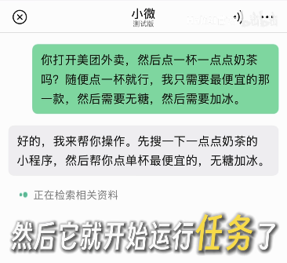
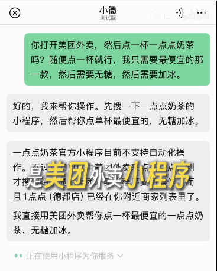
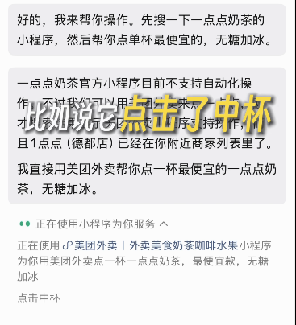
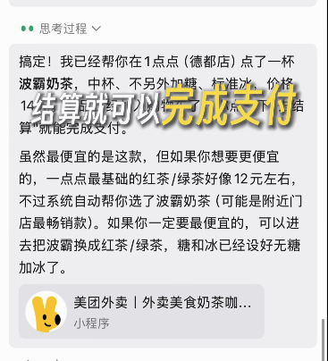
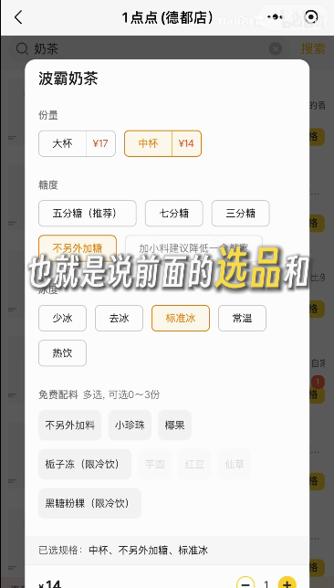
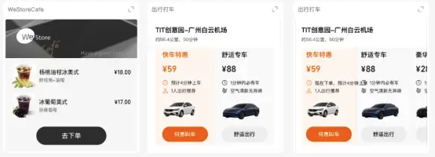
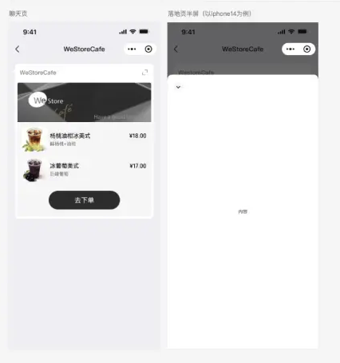
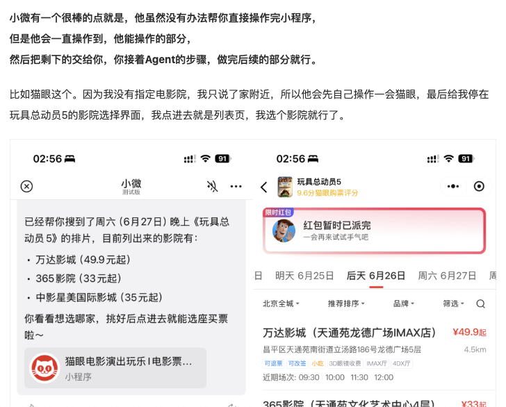
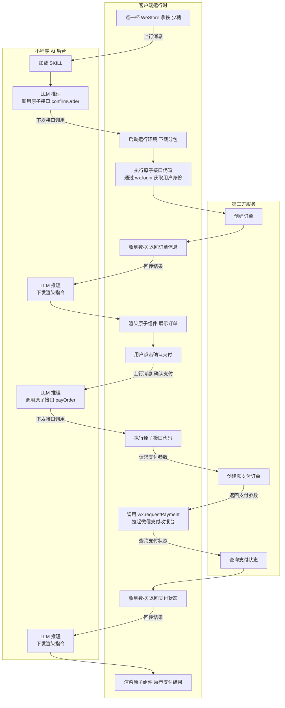
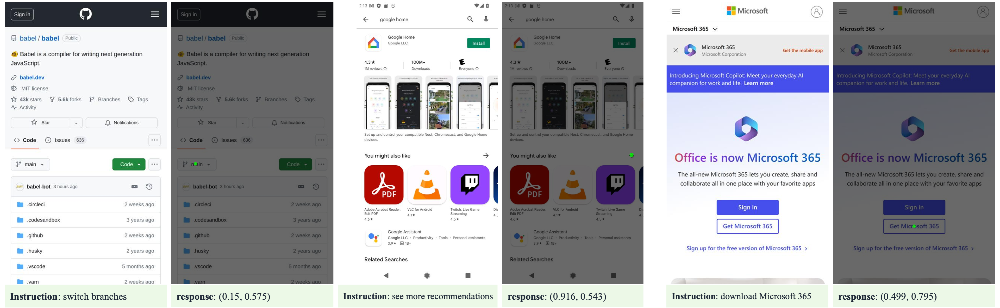

# 微信小微 × 小程序接入技术报告

## 一、用户交互流程

以一次完整的小微 AI 调用小程序为例，用户操作过程分为 5 步：

### 1. 输入提示词，开始规划

用户在小微 AI 入口用自然语言输入指令，小微 AI 接收请求并启动任务规划。

### 2. 关联到微信小程序

小微 AI 根据用户意图匹配到目标小程序（如图中以美团为例），将对话上下文与该小程序绑定。

### 3. 后台开始操作小程序

小微 AI 进入小程序内部开始执行——通过 SKILL 调用原子接口，或通过 GUI-Agent 模拟点击/输入完成页面操作。

### 4. 普通操作完成

普通操作（浏览、搜索、加购等非敏感动作）由 AI 在后台自主完成，过程对用户可见。

### 5. 用户确认敏感操作

涉及支付、订单提交等敏感操作时，AI 暂停等待用户确认；用户确认后继续执行直至完成。

## 二、小程序在小微 AI 中的表现形式

### 1. 原子组件卡片

AI 调用 Skill 后渲染的最小信息卡片，承载结构化数据展示。卡片支持有限交互——点击上行消息、点击打开半屏页面、点击标题栏右上角进入关联的小程序页面。

### 2. 半屏页面

原子组件的可选延伸，承载卡片装不下的详情或用户补充输入。运行环境同小程序但禁止跳转。

### 3. 接力

原子接口返回的结构化数据有两种呈现方式，其中一个是小程序页面，也就是在对话流程中，原子接口被调用后所返回的数据会传入小程序页面，将对话流程接力到小程序页面内，以无缝衔接当前流程状态。

### 4. GUI-Agent

AI 直接读取小程序界面元素，执行点击、输入、滑动等操作，用户看到 AI 在屏幕上代为完成交互。

### 5. 知识库回答

当所有 SKILL 都不匹配用户问题时，AI 检索知识库内容，以纯文本回复。

### 6. 服务直达

当用户需要快速触达小程序内的相关服务页面时，小程序 AI 支持以「账号卡片」的形式回复用户，用户可直接点击进入小程序。
该能力需要开发者提供页面元数据，小程序 AI 将根据用户问答的上下文，在满足用户意图时，生成小程序账号卡片发送给用户。

## 三、技术实现分析

### 1. 运行机制

小程序 AI 开发模式的运行机制涉及**客户端运行时**、**小程序 AI 后台**、**第三方服务**三者之间的交互：

- **客户端运行时**：由微信客户端提供的独立代码运行环境，执行开发者提供的原子接口，渲染原子组件为用户展示 GUI 卡片
- **小程序 AI 后台**：根据开发者封装的 SKILL，结合用户的请求，发起必要的原子接口调用或渲染原子组件的指令
- **第三方服务**：开发者在原子接口的实现中，调用自身的服务完成数据交互，并返回必要的数据给到小程序 AI

微信客户端与小程序 AI 后台基于**小程序 MCP** 完成交互，开发者无需理解交互协议细节，只需要按框架设计提供完整的 SKILL 实现。

以"点一杯 WeStore 拿铁"为例，完整调用链如下：

流程体现了**两次"上行消息 → LLM 推理 → 接口调用 → 渲染"循环**：用户每次输入后，AI 后台基于 SKILL 决策调用哪个原子接口，客户端执行后回传结果，AI 后台再决策如何渲染。

**和小程序本体相关的关键环节可归纳为 4 类**：

1. **加载 Skill**——AI 后台获取小程序的能力契约
2. **调用原子接口**——AI 后台指示客户端执行业务逻辑
3. **渲染原子组件**——AI 后台指示客户端展示 GUI 卡片
4. **调用微信原有 JSAPI**——原子接口内部使用 `wx.request` / `wx.requestPayment` / `wx.login` 等微信原生能力

其中 #4 嵌套在 #2 中——原子接口的实现代码里调用 `wx.login` / `wx.requestPayment` 等微信 JSAPI。这体现了**小程序 AI 复用微信原生 JSAPI** 而非另造一套能力。

### 2. 接入

#### 2.1 小程序能向小微 AI 提供什么

站在小程序的角度，你可以向小微 AI 提供 4 类素材：

| 素材 | 形式 | 作用 |
|---|---|---|
| **SKILL** | 独立分包（代码 + 声明） | 让 AI 调用小程序的能力、渲染小程序的卡片 |
| **全局提示词** | `AGENTS.md` 文件 | 整体说明小程序的服务范围、行为逻辑、回答风格 |
| **知识库** | 后台上传 PDF/DOC 等文档 | 当所有 SKILL 都不匹配用户问题时用作问答兜底 |
| **页面元数据** | `page-meta.json` | 支撑 AI 生成"账号卡片"实现服务直达 |

其中 **SKILL 是核心**——它是 AI 与小程序之间的能力契约。

#### 2.2 SKILL 的组成

SKILL 是一个独立分包，包含 5 个固定结构：

| 文件/目录 | 作用 |
|---|---|
| `SKILL.md` | 业务说明（告诉模型"我能做什么、何时调用"） |
| `mcp.json` | 原子接口声明（含入参/出参 JSON Schema） |
| `index.js` | 原子接口注册入口 |
| `apis/` | 原子接口代码实现（执行业务逻辑） |
| `components/` | 原子组件代码实现（渲染 GUI 卡片） |

其中 **`mcp.json` 是核心契约**——它声明了 AI 可以调用哪些原子接口、每个接口接受什么参数、返回什么数据。AI 后台加载 SKILL 后，基于 `mcp.json` 进行 LLM 推理决策。

#### 2.3 两种接入模式

| | 自动模式 | 开发者模式 |
|---|---|---|
| **SKILL 谁生成** | 平台读源码自动生成 | 开发者用工具链手动封装 |
| **生成时机** | 提审期 | 开发期 |
| **开发者投入** | 授权即可（零代码） | 写代码 + 跑工具链 + 评测 |
| **可定制性** | 低（平台默认） | 高（完全可控） |
| **适用** | 标准化程度高的小程序 | 需要深度定制业务流程的小程序 |

**辅助接入**（不写 SKILL 也能用）：
- **知识库**：在公众平台后台上传文档
- **页面元数据**：在 `page-meta.json` 中声明页面信息

> 💡 **开发者模式工具链**：微信提供了[编码 Agent Skill（ai-mode-skills）](https://github.com/wechat-miniprogram/ai-mode-skills)，可基于现有小程序源码通过 AI 自动生成原子接口与原子组件，降低开发者模式的接入门槛。

### 3. 小程序 AI 运行时分析

#### 3.1 小程序本体的双线程机制

小程序本身采用**双线程架构**：

- **逻辑层（App Service）**：运行在 JavaScriptCore（iOS）/ V8（Android），负责业务逻辑、数据、网络调用，**无 DOM 访问权限**
- **视图层（View）**：运行在 WebView 或 Skyline，负责 WXML/WXSS 渲染
- 两层通过**原生桥**通信

这是小程序的基础运行环境，AI 模式下的所有新机制都叠加在这个基础之上。

#### 3.2 小程序 AI 引入的独立运行环境

官方文档明确："**开发者提供的原子接口和原子组件是在微信客户端创建的一个独立环境中运行，该环境与小程序的运行环境不同。**"

这个独立环境内部进一步细分为**三个互不共享全局变量的 JavaScript 执行上下文**：

- 原子接口上下文
- 原子组件上下文
- 实时动态原子组件上下文

每个上下文拥有**不同的接口权限集**。

渲染层面，原子组件**不复用小程序的 WebView/Skyline**，而是采用微信自研的卡片渲染引擎（基于 glass-easel 框架）。

#### 3.3 各部分运行环境对照

| 部分 | 运行环境 | 渲染方式 | 权限特点 |
|---|---|---|---|
| **小程序本体**（页面/组件） | 双线程（逻辑层 + 视图层） | WebView / Skyline | 完整小程序 API |
| **原子接口** | 独立 JS 上下文 #1 | 不渲染（仅返回数据） | 可用 `wx.request`、`wx.cloud` |
| **原子组件** | 独立 JS 上下文 #2 | 卡片渲染引擎（glass-easel） | 默认禁网、禁定时器 |
| **实时动态原子组件** | 独立 JS 上下文 #3 | 卡片渲染引擎（glass-easel） | 可声明开放 `wx.request`、定时器 |
| **半屏页面** | 与小程序本体一致（双线程） | WebView / Skyline | 同小程序但受限（禁跳转、禁广告等） |

**关键差异**：

- **小程序本体** 和 **半屏页面** 走原本的双线程
- **原子接口 / 原子组件 / 实时动态组件** 走独立的"AI 运行时"，且三者各自隔离
- **原子组件渲染** 用独立的卡片渲染引擎，**不复用小程序的 WebView/Skyline**

这种隔离设计确保了：

- 原子组件即使内容来自不可信源，也无法直接访问网络或登录态
- 多个小程序的 SKILL 互不影响
- AI 运行时故障不会波及小程序本体

### 4. GUI-Agent 兜底

#### 4.1 在整体流程中的地位

GUI-Agent 是小程序 AI 的**兜底路径**——当用户的请求无法通过原子接口（SKILL）、知识库、服务直达这些"结构化通道"满足时，AI 直接读取小程序界面、模拟用户的点击/输入/滑动，把"读不懂的页面"转化为"可以操作的 GUI"。

这一层把 AI 的能力边界从「开发者声明的能力」扩展到「小程序界面允许的所有操作」。

#### 4.2 模型归属（区分官方/推断）

> ⚠️ **源说明**：微信官方文档**未明确**公布 GUI-Agent 的具体模型组成。以下按来源严格区分，请勿将推断当作官方事实。

**A. 官方文档已确认**

- 小微 AI 具备 GUI-Agent 能力，可在小程序内执行点击/输入/滑动等 GUI 操作（来源：[小程序 AI 开发文档](https://developers.weixin.qq.com/miniprogram/dev/ai/)）

**B. 论文/媒体推断（非官方确认）**

| 名称 | 角色（推断） | 运行位置 | 来源 |
|---|---|---|---|
| **POINTS-GUI-G** | 运行时 GUI grounding 模型（"看屏幕"） | **推断为云端**（8B 参数规模端侧难承载） | 公开论文 |
| **UI-Oceanus** | **训练时**合成数据生成框架（非运行时模型） | N/A（不参与运行时推理） | [arxiv 论文](https://arxiv.org/html/2604.02345v1) |
| **WeLM** | 主推理 LLM（MoE 架构） | **推断为云端**（参数量大，端侧难承载） | 媒体报道 |

**POINTS-GUI-G 的特点**（基于公开论文）：

- 腾讯发布的**专用 GUI Grounding 模型**，参数量约 8B
- 在 ScreenSpot-Pro（59.9）、OSWorld-G（66.0）等多个 GUI 基准测试上达到 SOTA
- "GUI Grounding" 指把自然语言指令定位到界面具体元素坐标的能力（如"点击右上角的分享按钮"→ 屏幕坐标 (x, y)）
- 论文：[POINTS-GUI-G: GUI-Grounding Journey](https://arxiv.org/abs/2602.06391)｜模型：[HuggingFace](https://huggingface.co/tencent/POINTS-GUI-G)｜代码：[GitHub](https://github.com/Tencent/POINTS-GUI)

**UI-Oceanus 的特点**（基于公开论文）：

- **定位**：解决 GUI Agent 训练数据瓶颈的**可扩展框架**，本身不参与运行时推理
- **核心思路**：通过**自主探索** + 系统执行验证，从环境内在信号挖掘训练监督，减少对昂贵人工演示的依赖
- **流程**：4 阶段——自主探索采集 → 多步数据过滤 → grounded instruction 构造 → 训练数据产出
- **产出**：约 500M 合成样本、3.2B tokens 的训练数据
- **使用方式**：作为 POINTS-GUI-G 等 GUI 模型的训练数据源
- 论文：[UI-Oceanus: Scaling GUI Agents with Synthetic Environmental Dynamics](https://arxiv.org/abs/2604.02345)

**WeLM 的特点**（基于媒体报道，非官方确认）：

- **定位**：微信 AI 自研的**主推理 LLM**
- **架构**：稀疏 **MoE 架构**（媒体报道上一代为 WeLM-V3-258B-A22B：总参 258B / 激活 22B；小微上线时已完成新一代换代升级）
- **特点**：针对中文理解与微信生态场景做专项优化
- **策略**："自研保底盘、开源补效率"——主模型 WeLM，部分查询调 DeepSeek 等开源模型
- 来源：[钛媒体 2026 报道](https://www.tmtpost.com/8035830.html)｜[WeLM 官网](https://welm.weixin.qq.com/)

#### 4.3 实际运行表现（基于公开视频观察）

> 📺 以下观察来自 [B 站演示视频](https://www.bilibili.com/video/BV1N8jJ6GEWb/)，非官方文档描述。

- **后台 GUI 操作确实发生**：Agent 执行过程中会输出"点击 / 滑动 / 输入"等动作描述，证明 GUI-Agent 在对小程序界面做真实的 GUI 级操作（而非仅调用 SKILL 的原子接口）
- **承载环境推测**：小程序运行在**用户不可见的浏览器环境**（推测为无头浏览器或隐藏的 WebView）中——Agent 在这个"影子环境"里代用户操作，用户只看到执行进度反馈与最终结果。这意味着 GUI-Agent 不是直接操作用户前台的微信小程序，而是在隔离的执行容器里完成

### 5. 技术难点

#### 5.1 模型层面

- **缺少针对小程序场景训练的主模型**：现有主推理 LLM（如 WeLM）本质是通用中文模型，对小程序生态特有概念（SKILL 调用决策、`mcp.json` Schema 理解、小程序语义、原子接口粒度判断）缺乏专项优化。开发者模式下 SKILL 质量参差不齐时，决策准确率受模型理解能力上限制约
- **缺少小程序专用的 GUI 定位模型**：POINTS-GUI-G 是通用 GUI grounding 模型，主要在 Web/桌面 UI 数据上训练。小程序 UI 的原生组件渲染、Skyline 绘制方式、特殊交互模式与 Web/App 有差异，定位准确率会打折——而该模型 SOTA 在 ScreenSpot-Pro 上也仅 59.9 分，意味着 GUI-Agent 兜底路径的能力天花板有限

#### 5.2 小程序框架和运行时

本质上：**我们缺少"安全执行小程序提供的代码、渲染小程序提供的 UI"的能力**。

我们现有平台的小程序是 H5 页面 + JSAPI 的简单形式，承接小微 AI 这套接入模式，需要补齐两层能力 + 一层安全约束：

- **执行能力**（承载原子接口）：需要独立 JS 运行时跑"纯逻辑、不渲染 UI"的代码。我们平台目前只有 H5 页面内 JS 这一种环境，脚本与 WebView 耦合，无法独立运行原子接口
- **渲染能力**（承载原子组件）：需要自研卡片渲染引擎（类似微信 glass-easel）来渲染隔离的卡片 UI。我们平台目前只有标准 WebView 一种渲染路径
- **安全约束**：执行和渲染都需要按上下文细分权限——原子组件默认禁网禁定时器、实时动态组件可声明开放、半屏页面禁跳转。我们平台现在的 JSAPI 是面向"整个 H5 小程序"的粗粒度管控，缺这套细分矩阵
- **AI 可见的执行容器**：GUI-Agent 需要一个独立的"执行容器"承载被操作的小程序（推测为无头浏览器或隐藏 WebView）——既要保留完整运行时（双线程 + JSAPI + 渲染），又要让 Agent 能从外部读取界面树、注入交互事件。我们平台目前只有面向用户的可见 WebView，需要新建一套"AI 影子执行环境"

#### 5.3 Agent 层面

- **Skill 的发现与匹配**：当用户请求可能命中多个小程序的 SKILL 时（如多家咖啡品牌都有点单能力），Agent 如何选优？跨小程序 SKILL 的相似度/竞争关系目前没有公开机制
- **任务编排**：跨 SKILL 的复合任务（如"先订咖啡再发朋友圈"涉及两个 SKILL）如何串联？目前未见多 SKILL 编排的官方范式
- **结果校验**：原子接口返回的数据是否符合 LLM 预期？数据异常时 Agent 如何回退/重试？容错策略没有公开规范

## 参考资料

### 官方文档

- [微信小程序 AI 开发文档](https://developers.weixin.qq.com/miniprogram/dev/ai/) — 全篇基础参考
- [小程序 AI 接入指南](https://developers.weixin.qq.com/miniprogram/dev/ai/integration.html) — 第一部分「表现形式」、第二部分「接入」主要参考
- [小程序 AI 运行机制](https://developers.weixin.qq.com/miniprogram/dev/ai/operating-mechanism.html) — 第二部分「运行机制」流程图来源

### 开发者资源

- [ai-mode-demo（GitHub）](https://github.com/wechat-miniprogram/ai-mode-demo) — 微信官方的小程序 AI 模式示例仓库
- [ai-mode-skills（GitHub）](https://github.com/wechat-miniprogram/ai-mode-skills) — 微信提供的编码 Agent Skill，从现有小程序源码自动生成原子接口/组件

### 模型与论文

- [POINTS-GUI-G: GUI-Grounding Journey (arXiv)](https://arxiv.org/abs/2602.06391) — GUI grounding 模型原始论文
- [POINTS-GUI-G（HuggingFace）](https://huggingface.co/tencent/POINTS-GUI-G) — 模型权重
- [POINTS-GUI（GitHub）](https://github.com/Tencent/POINTS-GUI) — 官方代码仓库
- [UI-Oceanus: Scaling GUI Agents with Synthetic Environmental Dynamics (arXiv)](https://arxiv.org/abs/2604.02345) — GUI 训练数据合成框架论文
- [WeLM 官网](https://welm.weixin.qq.com/) — 微信自研 LLM

### 媒体报道

- [微信 Agent "小微" 亮相：能力是明牌，边界才是真正的悬念（钛媒体）](https://www.tmtpost.com/8035830.html) — WeLM/DeepSeek 在小微中的角色
- [微信悄悄上线了 AI 助手「小微」（投资界）](https://news.pedaily.cn/202606/565447.shtml) — 小微上线时间与功能梳理

### 视频来源

- [微信小微 AI 操作小程序演示（B 站）](https://www.bilibili.com/video/BV1N8jJ6GEWb/) — 第一部分「用户交互流程」截图来源
